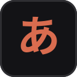

<div align="center">



# AnimeVocab

**Learn Japanese from the anime you watch — even before you can read it.**

A Chrome extension that watches with you, pauses on words worth learning,
and builds your review queue with spaced repetition. Free, open source, local-first.

[Install](#install) · [How it works](#how-it-works) · [Pro](#pro-subscription) · [Development](#development) · [Website](https://animevocab.com)

</div>

---

## What it does

You watch anime with English subtitles, like you always do. AnimeVocab detects
the Japanese actually being spoken, and when a common, level-appropriate word
comes up, it pauses on a card:

- the word in **romaji first** (*taikutsu*), with kana and kanji alongside — complete beginners can start from episode one
- its meaning, JLPT level, and the exact line it came from
- one keystroke to judge it: **I know it · Learn it · Ignore**

Words you're learning come back as quick memory checks in later episodes,
timed by a spaced-repetition scheduler — no flashcard app, no separate study
session. A dashboard tracks your streak, hours watched, and vocabulary by
JLPT level, computed entirely from local data.

**Supported sources**

| Source | How |
| --- | --- |
| YouTube | Reads the hidden Japanese caption track, even while you display English subs |
| Any site with HTML5 subtitle tracks | Hooks native `<track>` cues |
| Netflix, Crunchyroll, everything else | **Listening Mode** — real-time transcription of the tab's audio |

## Install

**From source (2 minutes):**

1. Download or clone this repository.
2. Open `chrome://extensions`, enable **Developer mode**.
3. Click **Load unpacked** and select the `extension/` folder.

A Chrome Web Store listing is in progress. See
[`extension/README-INSTALL.md`](extension/README-INSTALL.md) for details.

## How it works

- **Tokenization** runs locally with [kuromoji.js](https://github.com/takuyaa/kuromoji.js);
  the dictionary is a bundled [JMdict](https://www.edrdg.org/jmdict/j_jmdict.html)-derived
  JSON (~30k common words) with frequency ranks and JLPT levels.
- **Word picking** scores each token by frequency, distance from your target
  JLPT level, and how often you've met it — one card per line at most, with
  cooldowns and an hourly cap so it never becomes a quiz.
- **Listening Mode** captures tab audio and streams it to OpenAI's Realtime
  transcription API; cards appear within a couple of seconds of a line being
  spoken. Use it with a Pro subscription (no setup) or your own OpenAI API key.
- **Privacy by architecture**: no accounts, no analytics, no tracking. All
  progress lives in `chrome.storage.local`. In Listening Mode, audio goes
  directly from your browser to OpenAI — never through any AnimeVocab server.
  See [PRIVACY.md](PRIVACY.md).

## Pro subscription

The learning loop is free forever — it runs on your device and costs nothing
to operate. **Pro ($10/month or $84/year)** exists because real-time
transcription costs real money per minute:

- One-click Listening Mode: no OpenAI account, no API key
- Up to 45 listening-hours per month (fair use)
- Payments and license keys via Dodo Payments (merchant of record); no account needed — the license key is the whole identity

The backend is a single Cloudflare Worker ([`backend/`](backend/README.md))
that validates licenses, meters usage, and mints short-lived OpenAI tokens.
Audio never touches it.

## Development

TypeScript sources live in `src/`; `extension/` contains the manifest, static
assets, and committed build output (so load-unpacked works from a fresh clone).

```bash
npm install
npm run typecheck   # tsc --noEmit (strict)
npm run build       # bundle src/ → extension/ with esbuild
npm run watch       # rebuild on change
npm run pack        # typecheck + build + zip for store submission
```

Layout:

```
src/           extension source (TypeScript, strict)
  entries/     one bundle per context: content, background, offscreen, popup, options, dashboard, youtube-main
  lib/         shared modules: tokenizer, dictionary, scoring, SRS storage, overlay, romaji, site adapters
extension/     manifest, icons, HTML/CSS, vendored kuromoji, built JS
backend/       Cloudflare Worker for Pro (licensing, metering, token minting)
site/          static marketing site (animevocab.com)
scripts/       dictionary builder (JMdict → data/dictionary.json)
```

See [PUBLISHING.md](PUBLISHING.md) for Chrome Web Store submission steps.

## Contributing

Issues and pull requests are welcome. Useful starting points: new site
adapters (`src/lib/adapters/`), tokenizer edge cases, and dictionary quality.
Please run `npm run typecheck && npm run build` before submitting.

## License

[AGPL-3.0](LICENSE). The code is free to use, study, and modify; if you
distribute a modified version or run it as a service, your changes must be
open source too. For commercial licensing, open an issue.

## Support the project

If AnimeVocab helps you learn, consider
[sponsoring on GitHub](https://github.com/sponsors/Atharva-Kanherkar) or
subscribing to Pro.
